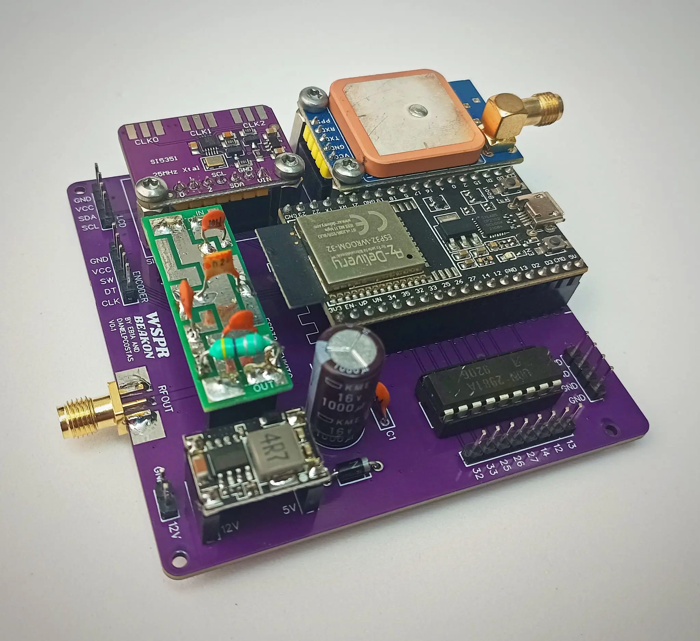

# WSPR Beakon

A multi-band WSPR (Weak Signal Propagation Reporter) beacon transmitter based on ESP32 microcontroller with Si5351 clock generator, GPS synchronization, WiFi connectivity, and band-switching capabilities.



## Features

- **Multi-band transmission**: 2200m to 2m amateur radio bands
- **Automatic time synchronization**: Via GPS or NTP over WiFi
- **Band switching**: Automated filter relay control
- **LCD display**: Real-time status and transmission countdown
- **Rotary encoder**: Easy frequency selection
- **GPS support**: Precise time synchronization with NEO-7 module
- **WiFi connectivity**: Multiple network support for NTP sync
- **Power control**: Configurable Si5351 drive levels

⚠️ **Hardware Limitation**: While the software supports frequencies up to 2m (144 MHz), the current hardware implementation using the Si5351 clock generator module is practically limited to frequencies up to 10m (28 MHz) due to the module's frequency response characteristics.

## Hardware Requirements

### Custom PCB Design

All components are mounted on a custom-designed PCB that houses all the electronic components in a compact and organized layout. The PCB design files are available in multiple versions, with the current version being **v1.01**.

**Download PCB Files**: Find all design files, including ready-to-manufacture Gerber files, in the [PCB folder](./PCB/)

### Bill of Materials (BOM)

The following tables show the components required for different WSPR Beakon configurations:

#### Table 1: Main PCB Components

| Component | Description | Quantity | Reference | Notes |
|-----------|-------------|----------|-----------|-------|
| WSPR Beakon PCB | Custom designed PCB v1.01 | 1 | - | Available in PCB folder |
| ESP32 DevKit C V4 | Microcontroller board | 1 | U1 | 38 pins |
| Si5351A | I2C clock generator | 1 | U2 | Breakout board |
| LCD Display | 16x2 character I2C | 1 | LCD1 | With I2C backpack |
| Rotary Encoder | With integrated push button | 1 | SW1 | 5 pins |
| UDN2981A | 8-channel relay driver | 1 | U3 | DIP-18 package |
| LM1117-3.3 | 3.3V voltage regulator | 1 | U4 | SOT-223 package |

#### Table 2: Passive Components

| Component | Description | Quantity | Reference | Notes |
|-----------|-------------|----------|-----------|-------|
| 10kΩ Resistor | Encoder pull-up | 3 | R1,R2,R3 | 1/4W |
| 330Ω Resistor | LED current limiting | 2 | R4,R5 | 1/4W |
| 1kΩ Resistor | General purpose | 2 | R6,R7 | 1/4W |
| 100nF Capacitor | Decoupling | 5 | C1-C5 | Ceramic |
| 10μF Capacitor | Power supply filter | 2 | C6,C7 | Electrolytic |
| 1000μF Capacitor | Main filter | 1 | C8 | 16V electrolytic |
| Red LED | Status indicator | 1 | LED1 | 3mm |
| Green LED | Transmission indicator | 1 | LED2 | 3mm |

#### Table 3: Connectors and Mechanical

| Component | Description | Quantity | Reference | Notes |
|-----------|-------------|----------|-----------|-------|
| DC Jack Connector | 12V power input | 1 | J1 | 2.1mm center positive |
| SMA Connector | RF output | 1 | J2 | Female for antenna |
| 2.54mm Header | GPS connections | 1 | J3 | 4 pins |
| 2.54mm Header | Relay connections | 8 | J4-J11 | 2 pins each |
| 2-pin Terminal | Alternative power input | 1 | J12 | 5.08mm pitch |
| M3 Spacers | PCB standoffs | 4 | - | 15mm height |
| M3 Screws | Mounting screws | 8 | - | 6mm length |

#### Table 4: Optional and External Components

| Component | Description | Quantity | Reference | Notes |
|-----------|-------------|----------|-----------|-------|
| GPS Module NEO-8M | Time synchronization | 1 | - | Optional, with antenna |
| Relay Modules | Band switching | 1-8 | - | 5V, depends on bands |
| Low-pass Filters | Per band used | 1-8 | - | According to band plan |
| 12V 2A Power Supply | External power source | 1 | - | With 2.1mm connector |
| Enclosure/Case | Circuit protection | 1 | - | See 3D models |
| WSPR Antenna | Multi-band or specific | 1 | - | According to operation bands |
| RF Cables | Antenna/filter connections | Variable | - | RG-58 or similar |

For detailed hardware assembly instructions, refer to the manual:

- [🇪🇸 Manual](./assets/Instrucciones_de_montaje.pdf) (Spanish)
- 🇬🇧 English (coming soon)

## Software Installation

### Prerequisites

1. **Arduino IDE**: Download and install from [arduino.cc](https://www.arduino.cc/en/software)
2. **ESP32 Board Package**: Install ESP32 support in Arduino IDE

### Arduino IDE Configuration

Configure Arduino IDE with the following settings:

- **Board**: "ESP32 Dev Module"
- **Upload Speed**: 921600
- **CPU Frequency**: 240MHz (WiFi/BT)
- **Flash Frequency**: 80MHz
- **Flash Mode**: QIO
- **Flash Size**: 4MB (32Mb)
- **Partition Scheme**: Default 4MB with spiffs
- **Core Debug Level**: None
- **PSRAM**: Disabled
- **Programmer**: Esptool

<p align="center">
  
</p>

### Library Installation

1. Extract all ZIP files from the `lib/` folder
2. Copy the extracted folders to your Arduino libraries directory:
   - **Windows**: `Documents\Arduino\libraries\`
   - **macOS**: `~/Documents/Arduino/libraries/`
   - **Linux**: `~/Arduino/libraries/`

Required libraries:

- Etherkit Si5351 (v2.1.4)
- JTEncode (v1.2.0)
- LiquidCrystal I2C (v1.1.4)
- NTPClient (v3.1.0)
- RotaryEncoder (v1.5.2)
- Time (v1.5)
- TinyGPSPlus (v1.1.0)

### Firmware Upload

1. Connect your ESP32 to your computer via USB cable
2. Open `wspr-beakon.ino` in Arduino IDE
3. Configure the required parameters (see Configuration section below)
4. Select the correct COM port in Arduino IDE
5. Click "Upload" to flash the firmware

## Configuration

Before uploading the firmware, you must modify the configuration variables in the `USER CONFIGURATION` section of the code:

### Basic WSPR Configuration

```cpp
// WSPR transmitter configuration
#define WSPR_CALL "EA1REX"  // Your 4-6 character callsign
#define WSPR_LOC "IN53"     // Your 4-character grid locator
#define WSPR_DBM 20         // Power level shown in WSPR frame (0, 3, 7, 10 dBm)
#define WSPR_TX_EVERY 4     // Transmit every X minutes (2, 4, 6, 8, 10, etc.)
```

### Si5351 Power Level

```cpp
// Available options: SI5351_DRIVE_2MA, SI5351_DRIVE_4MA, SI5351_DRIVE_6MA, SI5351_DRIVE_8MA
// Power output (tested values): 2mA = 1mW, 4mA = 2mW, 6mA = 5mW, 8mA = 10mW
#define SI5351_DRIVE_LEVEL SI5351_DRIVE_4MA
```

### WiFi Networks

Add your WiFi networks for NTP synchronization:

```cpp
const WiFiNetwork wifiNetworks[] = {
  {"Your_SSID_1", "password1"},
  {"Your_SSID_2", "password2"},
  {"Your_SSID_3", "password3"}
};
```

### Band Configuration

Configure frequencies, crystal calibration, and relay pins for each band:

```cpp
} wsprFrequencies[] = {
  // Frequency(Hz), Crystal_Freq(Hz), Label, Relay_Pin
  {144489000UL, 25000000UL, "144.489 MHz 2m",  0},    // 2m band (not supported by the Si5351)
  {70105048UL,  25000000UL, "70.091 MHz 4m",   0},    // 4m band (not supported by the Si5351)
  {50303500UL,  25000000UL, "50.293 MHz 6m",   0},    // 6m band (not supported by the Si5351)
  {28131120UL,  25000000UL, "28.124 MHz 10m",  12},   // 10m band
  {24924600UL,  25000000UL, "24.924 MHz 12m",  12},   // 12m band
  {21099330UL,  25000000UL, "21.094 MHz 15m",  14},   // 15m band
  {18104600UL,  25000000UL, "18.104 MHz 17m",  14},   // 17m band
  {14099615UL,  25000000UL, "14.095 MHz 20m",  27},   // 20m band
  {10142033UL,  25000000UL, "10.138 MHz 30m",  27},   // 30m band
  {7041356UL,   25000000UL, "7.038 MHz 40m",   26},   // 40m band
  {5287200UL,   25000000UL, "5.287 MHz 60m",   26},   // 60m band
  {3570732UL,   25000000UL, "3.568 MHz 80m",   25},   // 80m band
  {1838426UL,   25000000UL, "1.836 MHz 160m",  33},   // 160m band
  {475786UL,    25000000UL, "0.474 MHz 630m",  32},   // 630m band
  {136000UL,    25000000UL, "0.136 MHz 2200m", 32}    // 2200m band
};
```

**Note**: Bands with Relay_Pin set to `0` have filtering disabled. No band-switching relay will be activated for these frequencies.

### Relay Pin Assignment

The following ESP32 pins are used for band relay control:

- Pin 12: 10m, 12m bands
- Pin 14: 15m, 17m bands
- Pin 25: 80m band
- Pin 26: 40m, 60m bands
- Pin 27: 20m, 30m bands
- Pin 32: 630m, 2200m bands
- Pin 33: 160m band

**Important Notes:**

1. **Initial Crystal Frequency**: For the first upload, set all crystal frequencies to `25000000UL` (25 MHz)
2. **Calibration Required**: After initial upload, you'll need to calibrate each band for frequency accuracy
3. **Custom Frequencies**: The provided frequencies are examples - you must calculate your own based on your specific Si5351 crystal

## Post-Installation Calibration

After uploading the firmware with default settings:

1. **Frequency Calibration**: Each band requires individual crystal frequency calibration for accuracy
2. **Power Measurement**: Verify actual RF output power matches your requirements
3. **Filter Verification**: Ensure band-switching relays activate the correct low-pass filters
4. **GPS Testing**: Verify GPS module acquires satellites and provides accurate time
5. **WiFi Testing**: Confirm NTP synchronization works with your networks

⚠️ **Important**: This completes the software installation. For frequency calibration and fine-tuning procedures, refer to the hardware assembly manual.

### 3D Printed Case

3D models are available for download and printing to create a protective case for the WSPR Beakon. We recommend using **PETG filament** for optimal heat resistance, as the radio module can generate some heat during operation.

The 3D models include case components designed to provide proper ventilation while protecting the electronics.

📁 **Download 3D Models**: Find all printable files in the [3D folder](./3D/)

## Contributing

If you want to contribute to this project, please fork the repository, create a new branch, and submit a pull request. Contributions are welcome!

## Credits

This project has been developed as a collaborative effort between:

- **EB1A (Javier)** - RF engineering, radio frequency expertise, hardware design, and PCB development
- **EA1REX (Daniel)** - Software development, firmware implementation, hardware design, and PCB development

Both contributors have worked together on all aspects of the project, combining their expertise in radio frequency engineering and software development to create this comprehensive WSPR beacon solution.

This work has been carried out within the framework of the **URE (Unión de Radioaficionados Españoles) delegation in A Coruña**, Spain.

We extend our gratitude to the amateur radio community and the URE organization for their support and promotion of experimental radio projects.

## Legal Notice

This code is provided "as is," without any warranties, express or implied. The user assumes full responsibility for its use, implementation, and any consequences.

**Important:**

- Ensure that WSPR usage complies with local radio frequency regulations
- The author is not responsible for equipment damage, interference, or legal violations
- This code is for educational and experimental purposes only

By using this code, you acknowledge that you do so at your own risk.

## License

See `LICENSE.txt` for license information.
